```python
import numpy as np
import pandas as pd
import matplotlib.pyplot as plt
import seaborn as sns
sns.set_style('whitegrid')
%matplotlib inline
```


```python
airline = pd.read_csv('C:/Users/admin/Desktop/Misc_ML/Project_Datasets/Project_1_NYC-Flight_data/Project_1_NYC-Flight data/flight_data.csv')
```


```python
airline.shape
```


    (336776, 19)


```python
airline_null = pd.DataFrame((airline.isnull().sum()),columns=['Null_Values'])
airline_null['%ofNullValeues'] = ((airline_null['Null_Values'])/336776*100).sort_values(ascending=True)
airline_null
```


<div>
<style>
    .dataframe thead tr:only-child th {
        text-align: right;
    }

    .dataframe thead th {
        text-align: left;
    }

    .dataframe tbody tr th {
        vertical-align: top;
    }
</style>
<table border="1" class="dataframe">
  <thead>
    <tr style="text-align: right;">
      <th></th>
      <th>Null_Values</th>
      <th>%ofNullValeues</th>
    </tr>
  </thead>
  <tbody>
    <tr>
      <th>year</th>
      <td>0</td>
      <td>0.000000</td>
    </tr>
    <tr>
      <th>month</th>
      <td>0</td>
      <td>0.000000</td>
    </tr>
    <tr>
      <th>day</th>
      <td>0</td>
      <td>0.000000</td>
    </tr>
    <tr>
      <th>dep_time</th>
      <td>8255</td>
      <td>2.451184</td>
    </tr>
    <tr>
      <th>sched_dep_time</th>
      <td>0</td>
      <td>0.000000</td>
    </tr>
    <tr>
      <th>dep_delay</th>
      <td>8255</td>
      <td>2.451184</td>
    </tr>
    <tr>
      <th>arr_time</th>
      <td>8713</td>
      <td>2.587180</td>
    </tr>
    <tr>
      <th>sched_arr_time</th>
      <td>0</td>
      <td>0.000000</td>
    </tr>
    <tr>
      <th>arr_delay</th>
      <td>9430</td>
      <td>2.800081</td>
    </tr>
    <tr>
      <th>carrier</th>
      <td>0</td>
      <td>0.000000</td>
    </tr>
    <tr>
      <th>flight</th>
      <td>0</td>
      <td>0.000000</td>
    </tr>
    <tr>
      <th>tailnum</th>
      <td>2512</td>
      <td>0.745896</td>
    </tr>
    <tr>
      <th>origin</th>
      <td>0</td>
      <td>0.000000</td>
    </tr>
    <tr>
      <th>dest</th>
      <td>0</td>
      <td>0.000000</td>
    </tr>
    <tr>
      <th>air_time</th>
      <td>9430</td>
      <td>2.800081</td>
    </tr>
    <tr>
      <th>distance</th>
      <td>0</td>
      <td>0.000000</td>
    </tr>
    <tr>
      <th>hour</th>
      <td>0</td>
      <td>0.000000</td>
    </tr>
    <tr>
      <th>minute</th>
      <td>0</td>
      <td>0.000000</td>
    </tr>
    <tr>
      <th>time_hour</th>
      <td>0</td>
      <td>0.000000</td>
    </tr>
  </tbody>
</table>
</div>


```python
airline['dep_delay'].fillna(value=airline['dep_delay'].mean(),axis=0,inplace=True)
airline['air_time'].fillna(value=airline['air_time'].mean(),axis=0,inplace=True)
airline['air_time'].isnull().sum(),airline['distance'].isnull().sum()
airline['Velocity_Miles_Minutes'] = airline['distance']/airline['air_time']
airline.isnull().sum()
```


    year                         0
    month                        0
    day                          0
    dep_time                  8255
    sched_dep_time               0
    dep_delay                    0
    arr_time                  8713
    sched_arr_time               0
    arr_delay                 9430
    carrier                      0
    flight                       0
    tailnum                   2512
    origin                       0
    dest                         0
    air_time                     0
    distance                     0
    hour                         0
    minute                       0
    time_hour                    0
    Velocity_Miles_Minutes       0
    dtype: int64


```python
airline_no_delays = airline[airline['dep_delay'] == 0]
```


```python
airline_no_delays.isnull().sum()
```


    year                       0
    month                      0
    day                        0
    dep_time                   0
    sched_dep_time             0
    dep_delay                  0
    arr_time                  16
    sched_arr_time             0
    arr_delay                 48
    carrier                    0
    flight                     0
    tailnum                    0
    origin                     0
    dest                       0
    air_time                   0
    distance                   0
    hour                       0
    minute                     0
    time_hour                  0
    Velocity_Miles_Minutes     0
    dtype: int64


```python
airline_no_delays['arr_time'].fillna(value=airline_no_delays['arr_time'].mean(),axis=0,inplace=True)
```

    C:\Users\admin\Anaconda2\lib\site-packages\pandas\core\generic.py:3549: SettingWithCopyWarning: 
    A value is trying to be set on a copy of a slice from a DataFrame
    
    See the caveats in the documentation: http://pandas.pydata.org/pandas-docs/stable/indexing.html#indexing-view-versus-copy
      self._update_inplace(new_data)
    


```python
airline_no_delays.head()
```


<div>
<style>
    .dataframe thead tr:only-child th {
        text-align: right;
    }

    .dataframe thead th {
        text-align: left;
    }

    .dataframe tbody tr th {
        vertical-align: top;
    }
</style>
<table border="1" class="dataframe">
  <thead>
    <tr style="text-align: right;">
      <th></th>
      <th>year</th>
      <th>month</th>
      <th>day</th>
      <th>dep_time</th>
      <th>sched_dep_time</th>
      <th>dep_delay</th>
      <th>arr_time</th>
      <th>sched_arr_time</th>
      <th>arr_delay</th>
      <th>carrier</th>
      <th>flight</th>
      <th>tailnum</th>
      <th>origin</th>
      <th>dest</th>
      <th>air_time</th>
      <th>distance</th>
      <th>hour</th>
      <th>minute</th>
      <th>time_hour</th>
      <th>Velocity_Miles_Minutes</th>
    </tr>
  </thead>
  <tbody>
    <tr>
      <th>15</th>
      <td>2013</td>
      <td>1</td>
      <td>1</td>
      <td>559.0</td>
      <td>559</td>
      <td>0.0</td>
      <td>702.0</td>
      <td>706</td>
      <td>-4.0</td>
      <td>B6</td>
      <td>1806</td>
      <td>N708JB</td>
      <td>JFK</td>
      <td>BOS</td>
      <td>44.0</td>
      <td>187</td>
      <td>5</td>
      <td>59</td>
      <td>01-01-2013 05:00</td>
      <td>4.250000</td>
    </tr>
    <tr>
      <th>17</th>
      <td>2013</td>
      <td>1</td>
      <td>1</td>
      <td>600.0</td>
      <td>600</td>
      <td>0.0</td>
      <td>851.0</td>
      <td>858</td>
      <td>-7.0</td>
      <td>B6</td>
      <td>371</td>
      <td>N595JB</td>
      <td>LGA</td>
      <td>FLL</td>
      <td>152.0</td>
      <td>1076</td>
      <td>6</td>
      <td>0</td>
      <td>01-01-2013 06:00</td>
      <td>7.078947</td>
    </tr>
    <tr>
      <th>18</th>
      <td>2013</td>
      <td>1</td>
      <td>1</td>
      <td>600.0</td>
      <td>600</td>
      <td>0.0</td>
      <td>837.0</td>
      <td>825</td>
      <td>12.0</td>
      <td>MQ</td>
      <td>4650</td>
      <td>N542MQ</td>
      <td>LGA</td>
      <td>ATL</td>
      <td>134.0</td>
      <td>762</td>
      <td>6</td>
      <td>0</td>
      <td>01-01-2013 06:00</td>
      <td>5.686567</td>
    </tr>
    <tr>
      <th>24</th>
      <td>2013</td>
      <td>1</td>
      <td>1</td>
      <td>607.0</td>
      <td>607</td>
      <td>0.0</td>
      <td>858.0</td>
      <td>915</td>
      <td>-17.0</td>
      <td>UA</td>
      <td>1077</td>
      <td>N53442</td>
      <td>EWR</td>
      <td>MIA</td>
      <td>157.0</td>
      <td>1085</td>
      <td>6</td>
      <td>7</td>
      <td>01-01-2013 06:00</td>
      <td>6.910828</td>
    </tr>
    <tr>
      <th>28</th>
      <td>2013</td>
      <td>1</td>
      <td>1</td>
      <td>615.0</td>
      <td>615</td>
      <td>0.0</td>
      <td>1039.0</td>
      <td>1100</td>
      <td>-21.0</td>
      <td>B6</td>
      <td>709</td>
      <td>N794JB</td>
      <td>JFK</td>
      <td>SJU</td>
      <td>182.0</td>
      <td>1598</td>
      <td>6</td>
      <td>15</td>
      <td>01-01-2013 06:00</td>
      <td>8.780220</td>
    </tr>
  </tbody>
</table>
</div>


```python
airline['origin_to_dest'] = airline['origin'] +'_to_'+ airline['dest']
```


```python
from matplotlib.pyplot import show
import seaborn as sns
sns.set(style="darkgrid")
plt.figure(figsize=(6, 6))
total=airline_no_delays.shape[0]
ax = sns.countplot(x='origin', data=airline_no_delays)
for p in ax.patches:
    height = p.get_height()
    ax.text((p.get_x() + p.get_width()/2),
           height + 70,
           '{:1.2f}'.format(height/total),
            ha="center")
show()
```


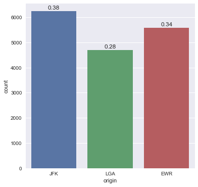


```python
airline_no_delays['origin'].value_counts()
```


    JFK    6239
    EWR    5585
    LGA    4690
    Name: origin, dtype: int64


```python
#airline_no_delays['Velocity_Miles_Minutes'] = airline_no_delays['distance']/airline_no_delays['air_time']
airline_no_delays['origin_to_dest'] = airline_no_delays['origin'] +'_to_'+ airline_no_delays['dest']
```

    C:\Users\admin\Anaconda2\lib\site-packages\ipykernel_launcher.py:2: SettingWithCopyWarning: 
    A value is trying to be set on a copy of a slice from a DataFrame.
    Try using .loc[row_indexer,col_indexer] = value instead
    
    See the caveats in the documentation: http://pandas.pydata.org/pandas-docs/stable/indexing.html#indexing-view-versus-copy
      
    


```python
airline_no_delays.head()
```


<div>
<style>
    .dataframe thead tr:only-child th {
        text-align: right;
    }

    .dataframe thead th {
        text-align: left;
    }

    .dataframe tbody tr th {
        vertical-align: top;
    }
</style>
<table border="1" class="dataframe">
  <thead>
    <tr style="text-align: right;">
      <th></th>
      <th>year</th>
      <th>month</th>
      <th>day</th>
      <th>dep_time</th>
      <th>sched_dep_time</th>
      <th>dep_delay</th>
      <th>arr_time</th>
      <th>sched_arr_time</th>
      <th>arr_delay</th>
      <th>carrier</th>
      <th>...</th>
      <th>tailnum</th>
      <th>origin</th>
      <th>dest</th>
      <th>air_time</th>
      <th>distance</th>
      <th>hour</th>
      <th>minute</th>
      <th>time_hour</th>
      <th>Velocity_Miles_Minutes</th>
      <th>origin_to_dest</th>
    </tr>
  </thead>
  <tbody>
    <tr>
      <th>15</th>
      <td>2013</td>
      <td>1</td>
      <td>1</td>
      <td>559.0</td>
      <td>559</td>
      <td>0.0</td>
      <td>702.0</td>
      <td>706</td>
      <td>-4.0</td>
      <td>B6</td>
      <td>...</td>
      <td>N708JB</td>
      <td>JFK</td>
      <td>BOS</td>
      <td>44.0</td>
      <td>187</td>
      <td>5</td>
      <td>59</td>
      <td>01-01-2013 05:00</td>
      <td>4.250000</td>
      <td>JFK_to_BOS</td>
    </tr>
    <tr>
      <th>17</th>
      <td>2013</td>
      <td>1</td>
      <td>1</td>
      <td>600.0</td>
      <td>600</td>
      <td>0.0</td>
      <td>851.0</td>
      <td>858</td>
      <td>-7.0</td>
      <td>B6</td>
      <td>...</td>
      <td>N595JB</td>
      <td>LGA</td>
      <td>FLL</td>
      <td>152.0</td>
      <td>1076</td>
      <td>6</td>
      <td>0</td>
      <td>01-01-2013 06:00</td>
      <td>7.078947</td>
      <td>LGA_to_FLL</td>
    </tr>
    <tr>
      <th>18</th>
      <td>2013</td>
      <td>1</td>
      <td>1</td>
      <td>600.0</td>
      <td>600</td>
      <td>0.0</td>
      <td>837.0</td>
      <td>825</td>
      <td>12.0</td>
      <td>MQ</td>
      <td>...</td>
      <td>N542MQ</td>
      <td>LGA</td>
      <td>ATL</td>
      <td>134.0</td>
      <td>762</td>
      <td>6</td>
      <td>0</td>
      <td>01-01-2013 06:00</td>
      <td>5.686567</td>
      <td>LGA_to_ATL</td>
    </tr>
    <tr>
      <th>24</th>
      <td>2013</td>
      <td>1</td>
      <td>1</td>
      <td>607.0</td>
      <td>607</td>
      <td>0.0</td>
      <td>858.0</td>
      <td>915</td>
      <td>-17.0</td>
      <td>UA</td>
      <td>...</td>
      <td>N53442</td>
      <td>EWR</td>
      <td>MIA</td>
      <td>157.0</td>
      <td>1085</td>
      <td>6</td>
      <td>7</td>
      <td>01-01-2013 06:00</td>
      <td>6.910828</td>
      <td>EWR_to_MIA</td>
    </tr>
    <tr>
      <th>28</th>
      <td>2013</td>
      <td>1</td>
      <td>1</td>
      <td>615.0</td>
      <td>615</td>
      <td>0.0</td>
      <td>1039.0</td>
      <td>1100</td>
      <td>-21.0</td>
      <td>B6</td>
      <td>...</td>
      <td>N794JB</td>
      <td>JFK</td>
      <td>SJU</td>
      <td>182.0</td>
      <td>1598</td>
      <td>6</td>
      <td>15</td>
      <td>01-01-2013 06:00</td>
      <td>8.780220</td>
      <td>JFK_to_SJU</td>
    </tr>
  </tbody>
</table>
<p>5 rows × 21 columns</p>
</div>


```python
airline_no_delays_JFK = airline_no_delays[airline_no_delays['origin'] == 'JFK']
airline_no_delays_EWR = airline_no_delays[airline_no_delays['origin'] == 'EWR']
airline_no_delays_LGA = airline_no_delays[airline_no_delays['origin'] == 'LGA']
airline_no_delays_JFK.shape, airline_no_delays_EWR.shape, airline_no_delays_LGA.shape
```


    ((6239, 21), (5585, 21), (4690, 21))


```python
#airline_no_delays_JFK.drop('dep_delay',axis=1,inplace=True)
#airline_no_delays_EWR.drop('dep_delay',axis=1,inplace=True)
#airline_no_delays_LGA.drop('dep_delay',axis=1,inplace=True)
```


```python
from matplotlib.pyplot import show
import seaborn as sns
sns.set(style="darkgrid")
plt.figure(figsize=(50,8))
total=airline_no_delays_JFK.shape[0]
ax = sns.countplot(x='dest', data=airline_no_delays_JFK)
ax.set_xlabel('Destination')
ax.set_ylabel('Number of Flights in Percentage ')
ax.set_title('Number of Flights towards differnet destination from JFK')
#ticks = ax.set_xticks(airline_no_delays_JFK['dest'])
#labels = ax.set_xticklabels([airline_no_delays_JFK['dest'].values], rotation=30,fontsize='small')
for p in ax.patches:
    height = p.get_height()
    ax.text((p.get_x() + p.get_width()/2),
           height + 10,
           '{:1.3f}'.format(height/total),
            ha="center")
show()

```


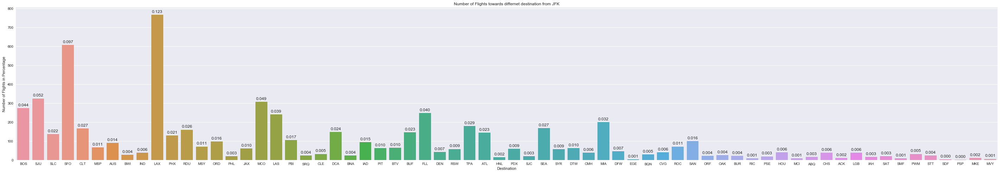


```python
from matplotlib.pyplot import show
import seaborn as sns
sns.set(style="darkgrid")
plt.figure(figsize=(50,8))
total=airline_no_delays_EWR.shape[0]
ax = sns.countplot(x='dest', data=airline_no_delays_EWR)
ax.set_xlabel('Destination')
ax.set_ylabel('Number of Flights in Percentage ')
ax.set_title('Number of Flights towards differnet destination from EWR')
#ticks = ax.set_xticks(airline_no_delays_JFK['dest'])
#labels = ax.set_xticklabels([airline_no_delays_JFK['dest'].values], rotation=30,fontsize='small')
for p in ax.patches:
    height = p.get_height()
    ax.text((p.get_x() + p.get_width()/2),
           height + 10,
           '{:1.3f}'.format(height/total),
            ha="center")
show()

```


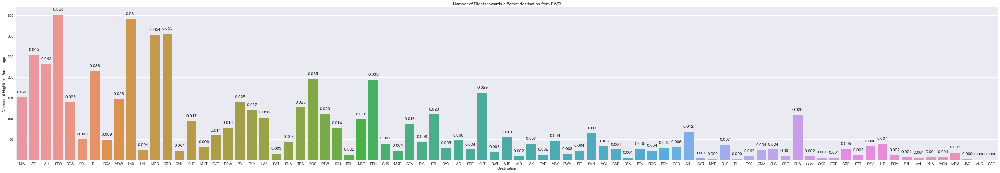


```python
from matplotlib.pyplot import show
import seaborn as sns
sns.set(style="darkgrid")
plt.figure(figsize=(50,8))
total=airline_no_delays_LGA.shape[0]
ax = sns.countplot(x='dest', data=airline_no_delays_LGA)
ax.set_xlabel('Destination')
ax.set_ylabel('Number of Flights in Percentage ')
ax.set_title('Number of Flights towards differnet destination from LGA')
#ticks = ax.set_xticks(airline_no_delays_JFK['dest'])
#labels = ax.set_xticklabels([airline_no_delays_JFK['dest'].values], rotation=30,fontsize='small')
for p in ax.patches:
    height = p.get_height()
    ax.text((p.get_x() + p.get_width()/2),
           height + 10,
           '{:1.3f}'.format(height/total),
            ha="center")
show()
```


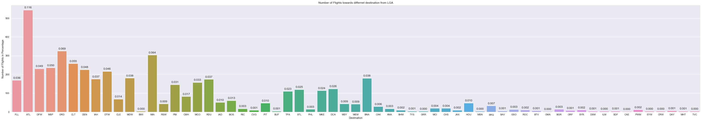


```python
import seaborn as sns
plt.figure(figsize=(15,4))
%timeit
sns.distplot(airline_no_delays_LGA['Velocity_Miles_Minutes'],hist=True,rug=True)

plt.figure(figsize=(15, 4))
sns.boxplot(airline_no_delays_LGA['Velocity_Miles_Minutes'],color='orchid')
```


    <matplotlib.axes._subplots.AxesSubplot at 0x10ac6748>


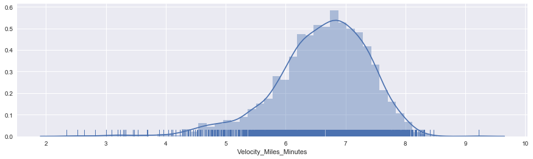


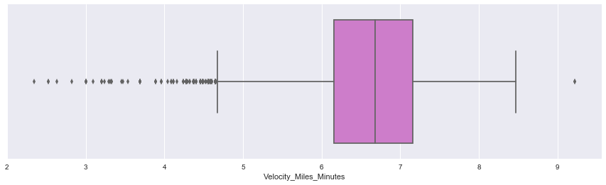


```python
import seaborn as sns
plt.figure(figsize=(15, 4))
%timeit
sns.distplot(airline_no_delays_JFK['Velocity_Miles_Minutes'],hist=True,rug=True)

plt.figure(figsize=(15, 4))
sns.boxplot(airline_no_delays_JFK['Velocity_Miles_Minutes'],color='orchid')
```


    <matplotlib.axes._subplots.AxesSubplot at 0x209ce4e0>


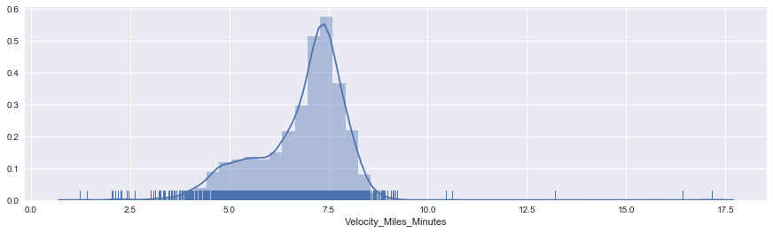


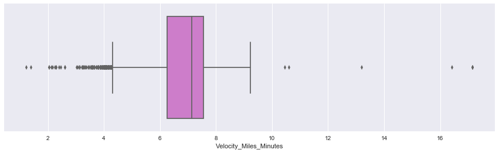


```python
import seaborn as sns
sns.set_style('whitegrid')
plt.figure(figsize=(15, 4))
%timeit
sns.distplot(airline_no_delays_EWR['Velocity_Miles_Minutes'],hist=True,rug=True)

plt.figure(figsize=(15, 4))
sns.boxplot(airline_no_delays_EWR['Velocity_Miles_Minutes'],color='orchid')
```


    <matplotlib.axes._subplots.AxesSubplot at 0x2524b518>


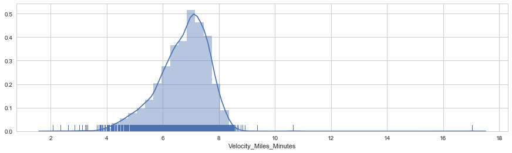


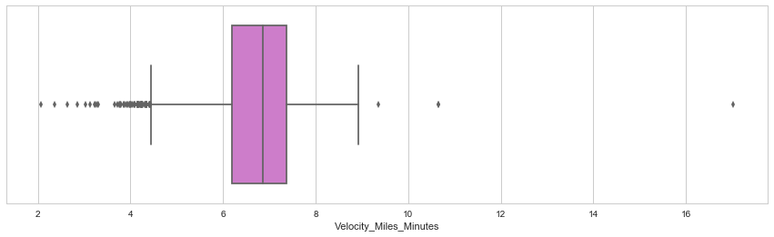


```python
import seaborn as sns
import matplotlib.pyplot as plt
sns.set_style('whitegrid')
plt.figure(figsize=(15, 6))

ax1 = airline_no_delays_EWR['Velocity_Miles_Minutes'].plot(kind='kde')
ax2 = airline_no_delays_JFK['Velocity_Miles_Minutes'].plot(kind='kde')
ax3 = airline_no_delays_LGA['Velocity_Miles_Minutes'].plot(kind='kde')

ax1.set_xlim([3,10])
ax2.set_xlim([3,10])
ax3.set_xlim([3,10])

 # plots an axis lable
plt.xlabel("Velocity in Miles per Minutes")    
plt.title("Velocity Distribution from different Origin points for no delays")
# sets our legend for our graph.
plt.legend(('Origin EWR', 'Origin JFK','Origin LGA'),loc='best') ;
```


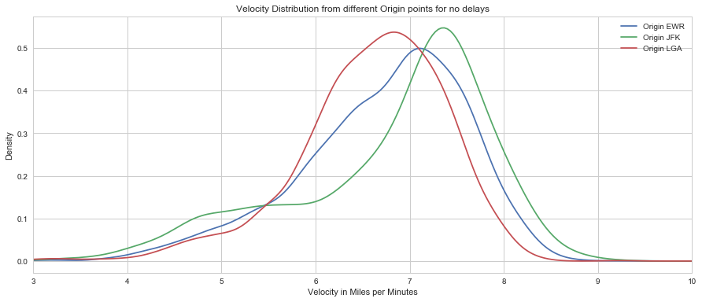


```python
import seaborn as sns
import matplotlib.pyplot as plt
sns.set_style('whitegrid')
plt.figure(figsize=(15, 6))

ax1 = sns.kdeplot(airline_no_delays_EWR['Velocity_Miles_Minutes'], shade = True)
ax2 = sns.kdeplot(airline_no_delays_JFK['Velocity_Miles_Minutes'], shade = True)
ax3 = sns.kdeplot(airline_no_delays_LGA['Velocity_Miles_Minutes'], shade = True)

ax1.set_xlim([3,10])
ax2.set_xlim([3,10])
ax3.set_xlim([3,10])

# plots an axis lable
plt.xlabel("Velocity in Miles per Minutes")    
plt.title("Velocity Distribution from different Origin points for no delays ")
# sets our legend for our graph.
plt.legend(('Origin EWR', 'Origin JFK','Origin LGA'),loc='best') ;
```


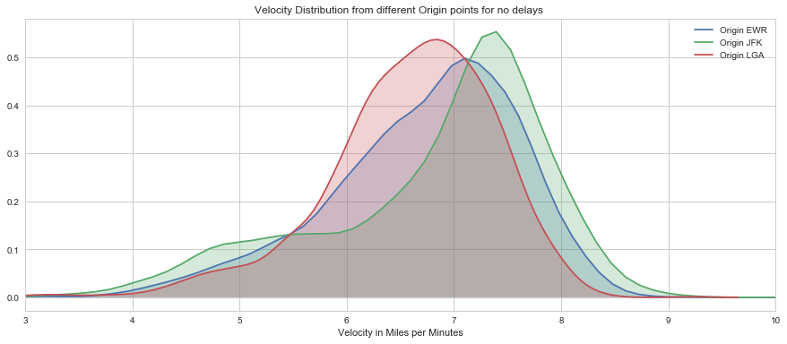


```python
airline_early_departures = airline[airline['dep_delay'] < 0]
airline_early_departures['Velocity_Miles_Minutes'] = airline_early_departures['distance']/airline_early_departures['air_time']
airline_early_departures['origin_to_dest'] = airline_early_departures['origin'] +'_to_'+ airline_early_departures['dest']
airline_early_departures_JFK = airline_early_departures[airline_early_departures['origin'] == 'JFK']
airline_early_departures_EWR = airline_early_departures[airline_early_departures['origin'] == 'EWR']
airline_early_departures_LGA = airline_early_departures[airline_early_departures['origin'] == 'LGA']
airline_early_departures_JFK.shape, airline_early_departures_EWR.shape, airline_early_departures_LGA.shape
```

    C:\Users\admin\Anaconda2\lib\site-packages\ipykernel_launcher.py:2: SettingWithCopyWarning: 
    A value is trying to be set on a copy of a slice from a DataFrame.
    Try using .loc[row_indexer,col_indexer] = value instead
    
    See the caveats in the documentation: http://pandas.pydata.org/pandas-docs/stable/indexing.html#indexing-view-versus-copy
      
    C:\Users\admin\Anaconda2\lib\site-packages\ipykernel_launcher.py:3: SettingWithCopyWarning: 
    A value is trying to be set on a copy of a slice from a DataFrame.
    Try using .loc[row_indexer,col_indexer] = value instead
    
    See the caveats in the documentation: http://pandas.pydata.org/pandas-docs/stable/indexing.html#indexing-view-versus-copy
      This is separate from the ipykernel package so we can avoid doing imports until
    


    ((61146, 21), (59300, 21), (63129, 21))


```python
import seaborn as sns
import matplotlib.pyplot as plt
sns.set_style('whitegrid')
plt.figure(figsize=(15, 6))

ax1 = airline_early_departures_EWR['Velocity_Miles_Minutes'].plot(kind='kde')
ax2 = airline_early_departures_JFK['Velocity_Miles_Minutes'].plot(kind='kde')
ax3 = airline_early_departures_LGA['Velocity_Miles_Minutes'].plot(kind='kde')

ax1.set_xlim([1,10])
ax2.set_xlim([1,10])
ax3.set_xlim([1,10])

 # plots an axis lable
plt.xlabel("Velocity in Miles per Minutes")    
plt.title("Velocity Distribution for early departure flights from different Origin points")
# sets our legend for our graph.
plt.legend(('Origin EWR', 'Origin JFK','Origin LGA'),loc='best') ;
```


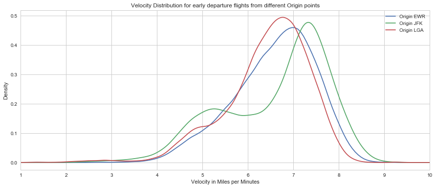


```python
import seaborn as sns
import matplotlib.pyplot as plt
sns.set_style('whitegrid')
plt.figure(figsize=(15, 6))

ax1 = sns.kdeplot(airline_early_departures_EWR['Velocity_Miles_Minutes'], shade = True)
ax2 = sns.kdeplot(airline_early_departures_JFK['Velocity_Miles_Minutes'], shade = True)
ax3 = sns.kdeplot(airline_early_departures_LGA['Velocity_Miles_Minutes'], shade = True)

ax1.set_xlim([1,10])
ax2.set_xlim([1,10])
ax3.set_xlim([1,10])

# plots an axis lable
plt.xlabel("Velocity in Miles per Minutes")    
plt.title("Velocity Distribution for early departure flights from different Origin points")
# sets our legend for our graph.
plt.legend(('Origin EWR', 'Origin JFK','Origin LGA'),loc='best') ;
```


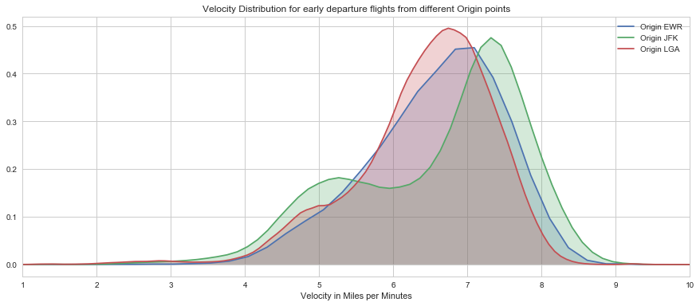


```python
airline_delayed_departures = airline[airline['dep_delay'] > 0]
airline_delayed_departures['Velocity_Miles_Minutes'] = airline_delayed_departures['distance']/airline_delayed_departures['air_time']
airline_delayed_departures['origin_to_dest'] = airline_delayed_departures['origin'] +'_to_'+ airline_delayed_departures['dest']
airline_delayed_departures_JFK = airline_delayed_departures[airline_delayed_departures['origin'] == 'JFK']
airline_delayed_departures_EWR = airline_delayed_departures[airline_delayed_departures['origin'] == 'EWR']
airline_delayed_departures_LGA = airline_delayed_departures[airline_delayed_departures['origin'] == 'LGA']
```

    C:\Users\admin\Anaconda2\lib\site-packages\ipykernel_launcher.py:2: SettingWithCopyWarning: 
    A value is trying to be set on a copy of a slice from a DataFrame.
    Try using .loc[row_indexer,col_indexer] = value instead
    
    See the caveats in the documentation: http://pandas.pydata.org/pandas-docs/stable/indexing.html#indexing-view-versus-copy
      
    C:\Users\admin\Anaconda2\lib\site-packages\ipykernel_launcher.py:3: SettingWithCopyWarning: 
    A value is trying to be set on a copy of a slice from a DataFrame.
    Try using .loc[row_indexer,col_indexer] = value instead
    
    See the caveats in the documentation: http://pandas.pydata.org/pandas-docs/stable/indexing.html#indexing-view-versus-copy
      This is separate from the ipykernel package so we can avoid doing imports until
    


```python
airline_delayed_departures_JFK.shape, airline_delayed_departures_EWR.shape, airline_delayed_departures_LGA.shape
```


    ((43894, 21), (55950, 21), (36843, 21))


```python
import seaborn as sns
import matplotlib.pyplot as plt
sns.set_style('whitegrid')
plt.figure(figsize=(15, 6))

ax1 = airline_delayed_departures_EWR['Velocity_Miles_Minutes'].plot(kind='kde')
ax2 = airline_delayed_departures_JFK['Velocity_Miles_Minutes'].plot(kind='kde')
ax3 = airline_delayed_departures_LGA['Velocity_Miles_Minutes'].plot(kind='kde')

ax1.set_xlim([1,10])
ax2.set_xlim([1,10])
ax3.set_xlim([1,10])

 # plots an axis lable
plt.xlabel("Velocity in Miles per Minutes")    
plt.title("Velocity Distribution for delayed flights from different Origin points")
# sets our legend for our graph.
plt.legend(('Origin EWR', 'Origin JFK','Origin LGA'),loc='best') ;
```


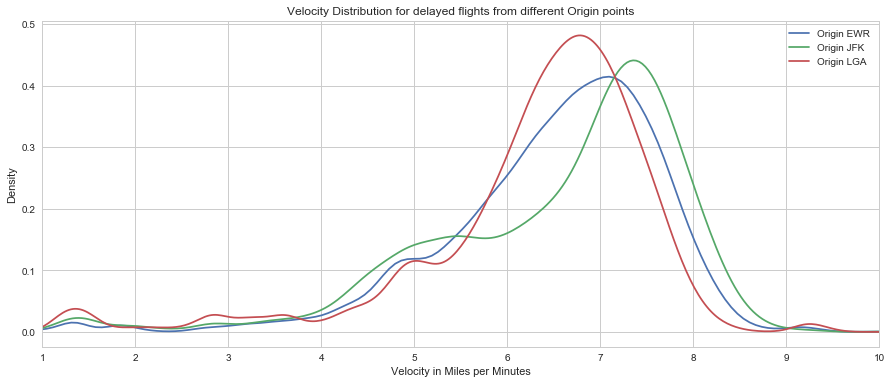


```python
import seaborn as sns
import matplotlib.pyplot as plt
sns.set_style('whitegrid')
plt.figure(figsize=(15, 6))

ax1 = sns.kdeplot(airline_delayed_departures_EWR['Velocity_Miles_Minutes'], shade = True)
ax2 = sns.kdeplot(airline_delayed_departures_JFK['Velocity_Miles_Minutes'], shade = True)
ax3 = sns.kdeplot(airline_delayed_departures_LGA['Velocity_Miles_Minutes'], shade = True)

ax1.set_xlim([1,10])
ax2.set_xlim([1,10])
ax3.set_xlim([1,10])

# plots an axis lable
plt.xlabel("Velocity in Miles per Minutes")    
plt.title("Velocity Distribution for delayed flights from different Origin points")
# sets our legend for our graph.
plt.legend(('Origin EWR', 'Origin JFK','Origin LGA'),loc='best') ;
```


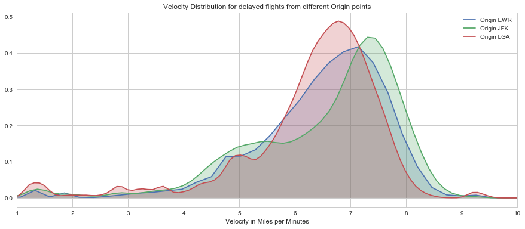


```python
airline_delayed_departures['origin'].value_counts()
```


    EWR    55950
    JFK    43894
    LGA    36843
    Name: origin, dtype: int64


```python
from matplotlib.pyplot import show
import seaborn as sns
sns.set(style="darkgrid")
plt.figure(figsize=(6, 6))
total=airline_delayed_departures.shape[0]
ax = sns.countplot(x='origin', data=airline_delayed_departures)
for p in ax.patches:
    height = p.get_height()
    ax.text((p.get_x() + p.get_width()/2),
           height + 100,
           '{:1.2f}'.format(height/total),
            ha="center")
show()
```


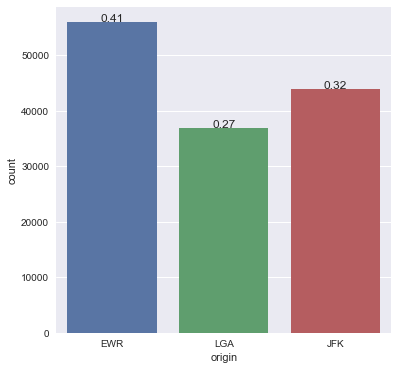


```python
airline_early_departures['origin'].value_counts()
```


    LGA    63129
    JFK    61146
    EWR    59300
    Name: origin, dtype: int64


```python
from matplotlib.pyplot import show
import seaborn as sns
sns.set(style="darkgrid")
plt.figure(figsize=(6, 6))
total=airline_early_departures.shape[0]
ax = sns.countplot(x='origin', data=airline_early_departures)
for p in ax.patches:
    height = p.get_height()
    ax.text((p.get_x() + p.get_width()/2),
           height + 100,
           '{:1.2f}'.format(height/total),
            ha="center")
show()
```


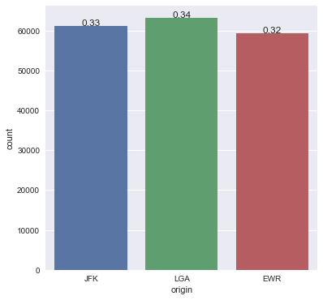


```python
# Best Airport as with "No Delays"

# JFK is the best airport from departure delays.

from matplotlib.pyplot import show
import seaborn as sns
sns.set(style="darkgrid")
plt.figure(figsize=(6, 6))
total=airline_no_delays.shape[0]
ax = sns.countplot(x='origin', data=airline_no_delays)
for p in ax.patches:
    height = p.get_height()
    ax.text((p.get_x() + p.get_width()/2),
           height + 100,
           '{:1.2f}'.format(height/total),
            ha="center")
show()
```


```python
airline_no_delays['dest'].value_counts().shape
```


    (99L,)


```python
airline_early_departures['dest'].value_counts().shape
```


    (104L,)


```python
airline_delayed_departures['dest'].value_counts().shape
```


    (104L,)


```python
airline['dest'].value_counts().shape
```


    (105L,)


```python
airline['origin_to_dest'].value_counts().shape
```


    (224L,)


```python
x = pd.DataFrame([airline['origin_to_dest'].value_counts()]).T
```


```python
x.head()
```


<div>
<style>
    .dataframe thead tr:only-child th {
        text-align: right;
    }

    .dataframe thead th {
        text-align: left;
    }

    .dataframe tbody tr th {
        vertical-align: top;
    }
</style>
<table border="1" class="dataframe">
  <thead>
    <tr style="text-align: right;">
      <th></th>
      <th>origin_to_dest</th>
    </tr>
  </thead>
  <tbody>
    <tr>
      <th>JFK_to_LAX</th>
      <td>11262</td>
    </tr>
    <tr>
      <th>LGA_to_ATL</th>
      <td>10263</td>
    </tr>
    <tr>
      <th>LGA_to_ORD</th>
      <td>8857</td>
    </tr>
    <tr>
      <th>JFK_to_SFO</th>
      <td>8204</td>
    </tr>
    <tr>
      <th>LGA_to_CLT</th>
      <td>6168</td>
    </tr>
  </tbody>
</table>
</div>


```python
x.index.name = 'Origin_To_Destionation'
```


```python
x.head()
```


<div>
<style>
    .dataframe thead tr:only-child th {
        text-align: right;
    }

    .dataframe thead th {
        text-align: left;
    }

    .dataframe tbody tr th {
        vertical-align: top;
    }
</style>
<table border="1" class="dataframe">
  <thead>
    <tr style="text-align: right;">
      <th></th>
      <th>origin_to_dest</th>
    </tr>
    <tr>
      <th>Origin_To_Destionation</th>
      <th></th>
    </tr>
  </thead>
  <tbody>
    <tr>
      <th>JFK_to_LAX</th>
      <td>11262</td>
    </tr>
    <tr>
      <th>LGA_to_ATL</th>
      <td>10263</td>
    </tr>
    <tr>
      <th>LGA_to_ORD</th>
      <td>8857</td>
    </tr>
    <tr>
      <th>JFK_to_SFO</th>
      <td>8204</td>
    </tr>
    <tr>
      <th>LGA_to_CLT</th>
      <td>6168</td>
    </tr>
  </tbody>
</table>
</div>


```python
airline_delayed_departures.shape, airline_no_delays.shape, airline_early_departures.shape
```


    ((136687, 21), (16514, 21), (183575, 21))


```python
airline.shape
```


    (336776, 21)


```python
airline.head()
```


<div>
<style>
    .dataframe thead tr:only-child th {
        text-align: right;
    }

    .dataframe thead th {
        text-align: left;
    }

    .dataframe tbody tr th {
        vertical-align: top;
    }
</style>
<table border="1" class="dataframe">
  <thead>
    <tr style="text-align: right;">
      <th></th>
      <th>year</th>
      <th>month</th>
      <th>day</th>
      <th>dep_time</th>
      <th>sched_dep_time</th>
      <th>dep_delay</th>
      <th>arr_time</th>
      <th>sched_arr_time</th>
      <th>arr_delay</th>
      <th>carrier</th>
      <th>...</th>
      <th>tailnum</th>
      <th>origin</th>
      <th>dest</th>
      <th>air_time</th>
      <th>distance</th>
      <th>hour</th>
      <th>minute</th>
      <th>time_hour</th>
      <th>Velocity_Miles_Minutes</th>
      <th>origin_to_dest</th>
    </tr>
  </thead>
  <tbody>
    <tr>
      <th>0</th>
      <td>2013</td>
      <td>1</td>
      <td>1</td>
      <td>517.0</td>
      <td>515</td>
      <td>2.0</td>
      <td>830.0</td>
      <td>819</td>
      <td>11.0</td>
      <td>UA</td>
      <td>...</td>
      <td>N14228</td>
      <td>EWR</td>
      <td>IAH</td>
      <td>227.0</td>
      <td>1400</td>
      <td>5</td>
      <td>15</td>
      <td>01-01-2013 05:00</td>
      <td>6.167401</td>
      <td>EWR_to_IAH</td>
    </tr>
    <tr>
      <th>1</th>
      <td>2013</td>
      <td>1</td>
      <td>1</td>
      <td>533.0</td>
      <td>529</td>
      <td>4.0</td>
      <td>850.0</td>
      <td>830</td>
      <td>20.0</td>
      <td>UA</td>
      <td>...</td>
      <td>N24211</td>
      <td>LGA</td>
      <td>IAH</td>
      <td>227.0</td>
      <td>1416</td>
      <td>5</td>
      <td>29</td>
      <td>01-01-2013 05:00</td>
      <td>6.237885</td>
      <td>LGA_to_IAH</td>
    </tr>
    <tr>
      <th>2</th>
      <td>2013</td>
      <td>1</td>
      <td>1</td>
      <td>542.0</td>
      <td>540</td>
      <td>2.0</td>
      <td>923.0</td>
      <td>850</td>
      <td>33.0</td>
      <td>AA</td>
      <td>...</td>
      <td>N619AA</td>
      <td>JFK</td>
      <td>MIA</td>
      <td>160.0</td>
      <td>1089</td>
      <td>5</td>
      <td>40</td>
      <td>01-01-2013 05:00</td>
      <td>6.806250</td>
      <td>JFK_to_MIA</td>
    </tr>
    <tr>
      <th>3</th>
      <td>2013</td>
      <td>1</td>
      <td>1</td>
      <td>544.0</td>
      <td>545</td>
      <td>-1.0</td>
      <td>1004.0</td>
      <td>1022</td>
      <td>-18.0</td>
      <td>B6</td>
      <td>...</td>
      <td>N804JB</td>
      <td>JFK</td>
      <td>BQN</td>
      <td>183.0</td>
      <td>1576</td>
      <td>5</td>
      <td>45</td>
      <td>01-01-2013 05:00</td>
      <td>8.612022</td>
      <td>JFK_to_BQN</td>
    </tr>
    <tr>
      <th>4</th>
      <td>2013</td>
      <td>1</td>
      <td>1</td>
      <td>554.0</td>
      <td>600</td>
      <td>-6.0</td>
      <td>812.0</td>
      <td>837</td>
      <td>-25.0</td>
      <td>DL</td>
      <td>...</td>
      <td>N668DN</td>
      <td>LGA</td>
      <td>ATL</td>
      <td>116.0</td>
      <td>762</td>
      <td>6</td>
      <td>0</td>
      <td>01-01-2013 06:00</td>
      <td>6.568966</td>
      <td>LGA_to_ATL</td>
    </tr>
  </tbody>
</table>
<p>5 rows × 21 columns</p>
</div>


```python
airline_ontime_arrival = airline[airline['arr_delay'] == 0]
```


```python
airline_ontime_arrival.shape
```


    (5409, 21)


```python
airline_ontime_arrival.isnull().sum()
```


    year                      0
    month                     0
    day                       0
    dep_time                  0
    sched_dep_time            0
    dep_delay                 0
    arr_time                  0
    sched_arr_time            0
    arr_delay                 0
    carrier                   0
    flight                    0
    tailnum                   0
    origin                    0
    dest                      0
    air_time                  0
    distance                  0
    hour                      0
    minute                    0
    time_hour                 0
    Velocity_Miles_Minutes    0
    origin_to_dest            0
    dtype: int64


```python
airline_ontime_arrival.head()
```


<div>
<style>
    .dataframe thead tr:only-child th {
        text-align: right;
    }

    .dataframe thead th {
        text-align: left;
    }

    .dataframe tbody tr th {
        vertical-align: top;
    }
</style>
<table border="1" class="dataframe">
  <thead>
    <tr style="text-align: right;">
      <th></th>
      <th>year</th>
      <th>month</th>
      <th>day</th>
      <th>dep_time</th>
      <th>sched_dep_time</th>
      <th>dep_delay</th>
      <th>arr_time</th>
      <th>sched_arr_time</th>
      <th>arr_delay</th>
      <th>carrier</th>
      <th>...</th>
      <th>tailnum</th>
      <th>origin</th>
      <th>dest</th>
      <th>air_time</th>
      <th>distance</th>
      <th>hour</th>
      <th>minute</th>
      <th>time_hour</th>
      <th>Velocity_Miles_Minutes</th>
      <th>origin_to_dest</th>
    </tr>
  </thead>
  <tbody>
    <tr>
      <th>35</th>
      <td>2013</td>
      <td>1</td>
      <td>1</td>
      <td>627.0</td>
      <td>630</td>
      <td>-3.0</td>
      <td>1018.0</td>
      <td>1018</td>
      <td>0.0</td>
      <td>US</td>
      <td>...</td>
      <td>N535UW</td>
      <td>JFK</td>
      <td>PHX</td>
      <td>330.0</td>
      <td>2153</td>
      <td>6</td>
      <td>30</td>
      <td>01-01-2013 06:00</td>
      <td>6.524242</td>
      <td>JFK_to_PHX</td>
    </tr>
    <tr>
      <th>114</th>
      <td>2013</td>
      <td>1</td>
      <td>1</td>
      <td>807.0</td>
      <td>810</td>
      <td>-3.0</td>
      <td>1043.0</td>
      <td>1043</td>
      <td>0.0</td>
      <td>DL</td>
      <td>...</td>
      <td>N308DE</td>
      <td>JFK</td>
      <td>ATL</td>
      <td>126.0</td>
      <td>760</td>
      <td>8</td>
      <td>10</td>
      <td>01-01-2013 08:00</td>
      <td>6.031746</td>
      <td>JFK_to_ATL</td>
    </tr>
    <tr>
      <th>217</th>
      <td>2013</td>
      <td>1</td>
      <td>1</td>
      <td>956.0</td>
      <td>1000</td>
      <td>-4.0</td>
      <td>1241.0</td>
      <td>1241</td>
      <td>0.0</td>
      <td>DL</td>
      <td>...</td>
      <td>N956DL</td>
      <td>LGA</td>
      <td>ATL</td>
      <td>129.0</td>
      <td>762</td>
      <td>10</td>
      <td>0</td>
      <td>01-01-2013 10:00</td>
      <td>5.906977</td>
      <td>LGA_to_ATL</td>
    </tr>
    <tr>
      <th>273</th>
      <td>2013</td>
      <td>1</td>
      <td>1</td>
      <td>1124.0</td>
      <td>1125</td>
      <td>-1.0</td>
      <td>1445.0</td>
      <td>1445</td>
      <td>0.0</td>
      <td>DL</td>
      <td>...</td>
      <td>N376NW</td>
      <td>LGA</td>
      <td>RSW</td>
      <td>169.0</td>
      <td>1080</td>
      <td>11</td>
      <td>25</td>
      <td>01-01-2013 11:00</td>
      <td>6.390533</td>
      <td>LGA_to_RSW</td>
    </tr>
    <tr>
      <th>317</th>
      <td>2013</td>
      <td>1</td>
      <td>1</td>
      <td>1219.0</td>
      <td>1220</td>
      <td>-1.0</td>
      <td>1415.0</td>
      <td>1415</td>
      <td>0.0</td>
      <td>AA</td>
      <td>...</td>
      <td>N545AA</td>
      <td>LGA</td>
      <td>STL</td>
      <td>161.0</td>
      <td>888</td>
      <td>12</td>
      <td>20</td>
      <td>01-01-2013 12:00</td>
      <td>5.515528</td>
      <td>LGA_to_STL</td>
    </tr>
  </tbody>
</table>
<p>5 rows × 21 columns</p>
</div>


```python
airline_ontime_arrival['origin_to_dest'].value_counts().head()
```


    LGA_to_ATL    206
    JFK_to_LAX    196
    JFK_to_SFO    141
    LGA_to_CLT    120
    LGA_to_ORD    115
    Name: origin_to_dest, dtype: int64


```python

```


```python
import seaborn as sns
plt.figure(figsize=(15,4))
%timeit
sns.distplot(airline_ontime_arrival['Velocity_Miles_Minutes'],hist=True,rug=True)
# plots an axis lable
plt.xlabel("Velocity in Miles per Minutes")
#plt.ytitle("Density")
plt.title("Velocity Distribution for flights with no delays in arrivals")
```


    <matplotlib.text.Text at 0x3717e6a0>


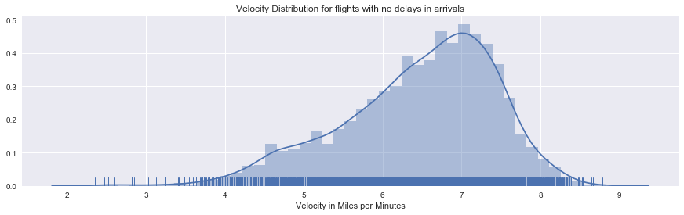


```python
airline_ontime_arrival.shape,airline_no_delays.shape 
```


    ((5409, 21), (16514, 21))


```python
airline_ontime_arrival['origin'].value_counts()
```


    EWR    1916
    JFK    1804
    LGA    1689
    Name: origin, dtype: int64


```python
airline_ontime_arrival.groupby(['origin','month'])['origin'].count()
```


    origin  month
    EWR     1        175
            2        156
            3        154
            4        173
            5        141
            6        136
            7        136
            8        184
            9        125
            10       183
            11       177
            12       176
    JFK     1        166
            2        123
            3        139
            4        150
            5        127
            6        138
            7        157
            8        161
            9        121
            10       177
            11       180
            12       165
    LGA     1        164
            2        133
            3        137
            4        143
            5        112
            6        132
            7        108
            8        133
            9        138
            10       169
            11       161
            12       159
    Name: origin, dtype: int64


```python
airline_ontime_arrival.head()
```


<div>
<style>
    .dataframe thead tr:only-child th {
        text-align: right;
    }

    .dataframe thead th {
        text-align: left;
    }

    .dataframe tbody tr th {
        vertical-align: top;
    }
</style>
<table border="1" class="dataframe">
  <thead>
    <tr style="text-align: right;">
      <th></th>
      <th>year</th>
      <th>month</th>
      <th>day</th>
      <th>dep_time</th>
      <th>sched_dep_time</th>
      <th>dep_delay</th>
      <th>arr_time</th>
      <th>sched_arr_time</th>
      <th>arr_delay</th>
      <th>carrier</th>
      <th>...</th>
      <th>tailnum</th>
      <th>origin</th>
      <th>dest</th>
      <th>air_time</th>
      <th>distance</th>
      <th>hour</th>
      <th>minute</th>
      <th>time_hour</th>
      <th>Velocity_Miles_Minutes</th>
      <th>origin_to_dest</th>
    </tr>
  </thead>
  <tbody>
    <tr>
      <th>35</th>
      <td>2013</td>
      <td>1</td>
      <td>1</td>
      <td>627.0</td>
      <td>630</td>
      <td>-3.0</td>
      <td>1018.0</td>
      <td>1018</td>
      <td>0.0</td>
      <td>US</td>
      <td>...</td>
      <td>N535UW</td>
      <td>JFK</td>
      <td>PHX</td>
      <td>330.0</td>
      <td>2153</td>
      <td>6</td>
      <td>30</td>
      <td>01-01-2013 06:00</td>
      <td>6.524242</td>
      <td>JFK_to_PHX</td>
    </tr>
    <tr>
      <th>114</th>
      <td>2013</td>
      <td>1</td>
      <td>1</td>
      <td>807.0</td>
      <td>810</td>
      <td>-3.0</td>
      <td>1043.0</td>
      <td>1043</td>
      <td>0.0</td>
      <td>DL</td>
      <td>...</td>
      <td>N308DE</td>
      <td>JFK</td>
      <td>ATL</td>
      <td>126.0</td>
      <td>760</td>
      <td>8</td>
      <td>10</td>
      <td>01-01-2013 08:00</td>
      <td>6.031746</td>
      <td>JFK_to_ATL</td>
    </tr>
    <tr>
      <th>217</th>
      <td>2013</td>
      <td>1</td>
      <td>1</td>
      <td>956.0</td>
      <td>1000</td>
      <td>-4.0</td>
      <td>1241.0</td>
      <td>1241</td>
      <td>0.0</td>
      <td>DL</td>
      <td>...</td>
      <td>N956DL</td>
      <td>LGA</td>
      <td>ATL</td>
      <td>129.0</td>
      <td>762</td>
      <td>10</td>
      <td>0</td>
      <td>01-01-2013 10:00</td>
      <td>5.906977</td>
      <td>LGA_to_ATL</td>
    </tr>
    <tr>
      <th>273</th>
      <td>2013</td>
      <td>1</td>
      <td>1</td>
      <td>1124.0</td>
      <td>1125</td>
      <td>-1.0</td>
      <td>1445.0</td>
      <td>1445</td>
      <td>0.0</td>
      <td>DL</td>
      <td>...</td>
      <td>N376NW</td>
      <td>LGA</td>
      <td>RSW</td>
      <td>169.0</td>
      <td>1080</td>
      <td>11</td>
      <td>25</td>
      <td>01-01-2013 11:00</td>
      <td>6.390533</td>
      <td>LGA_to_RSW</td>
    </tr>
    <tr>
      <th>317</th>
      <td>2013</td>
      <td>1</td>
      <td>1</td>
      <td>1219.0</td>
      <td>1220</td>
      <td>-1.0</td>
      <td>1415.0</td>
      <td>1415</td>
      <td>0.0</td>
      <td>AA</td>
      <td>...</td>
      <td>N545AA</td>
      <td>LGA</td>
      <td>STL</td>
      <td>161.0</td>
      <td>888</td>
      <td>12</td>
      <td>20</td>
      <td>01-01-2013 12:00</td>
      <td>5.515528</td>
      <td>LGA_to_STL</td>
    </tr>
  </tbody>
</table>
<p>5 rows × 21 columns</p>
</div>


```python
airline_ontime_arrival_JFK = airline_ontime_arrival[airline_ontime_arrival['origin'] == 'JFK']
airline_ontime_arrival_EWR = airline_ontime_arrival[airline_ontime_arrival['origin'] == 'EWR']
airline_ontime_arrival_LGA = airline_ontime_arrival[airline_ontime_arrival['origin'] == 'LGA']
airline_ontime_arrival_JFK.shape, airline_ontime_arrival_EWR.shape, airline_ontime_arrival_LGA.shape
```


    ((1804, 21), (1916, 21), (1689, 21))


```python
import seaborn as sns
import matplotlib.pyplot as plt
sns.set_style('whitegrid')
plt.figure(figsize=(15, 6))

ax1 = airline_ontime_arrival_JFK['Velocity_Miles_Minutes'].plot(kind='kde')
ax2 = airline_ontime_arrival_EWR['Velocity_Miles_Minutes'].plot(kind='kde')
ax3 = airline_ontime_arrival_LGA['Velocity_Miles_Minutes'].plot(kind='kde')

ax1.set_xlim([1,10])
ax2.set_xlim([1,10])
ax3.set_xlim([1,10])

 # plots an axis lable
plt.xlabel("Velocity in Miles per Minutes")    
plt.title("Velocity Distribution for the flights with no arrival delays ")
# sets our legend for our graph.
plt.legend(('Origin EWR', 'Origin JFK','Origin LGA'),loc='best') ;
```


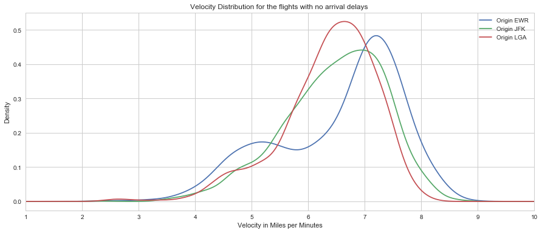


```python
import seaborn as sns
import matplotlib.pyplot as plt
sns.set_style('whitegrid')
plt.figure(figsize=(15, 6))

ax1 = sns.kdeplot(airline_ontime_arrival_JFK['Velocity_Miles_Minutes'], shade = True)
ax2 = sns.kdeplot(airline_ontime_arrival_EWR['Velocity_Miles_Minutes'], shade = True)
ax3 = sns.kdeplot(airline_ontime_arrival_LGA['Velocity_Miles_Minutes'], shade = True)

ax1.set_xlim([1,10])
ax2.set_xlim([1,10])
ax3.set_xlim([1,10])

# plots an axis lable
plt.xlabel("Velocity in Miles per Minutes")    
plt.title("Velocity Distribution for the flights with no delays in arrivals")
# sets our legend for our graph.
plt.legend(('Origin EWR', 'Origin JFK','Origin LGA'),loc='best') ;
```


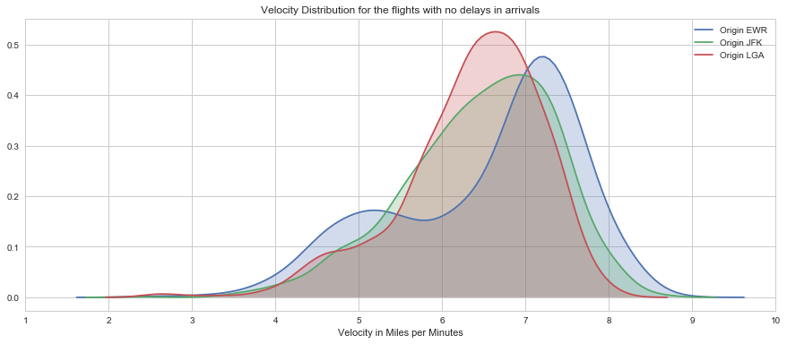


```python
airline_ontime_arrival['origin'].value_counts()
```


    EWR    1916
    JFK    1804
    LGA    1689
    Name: origin, dtype: int64


```python

```
